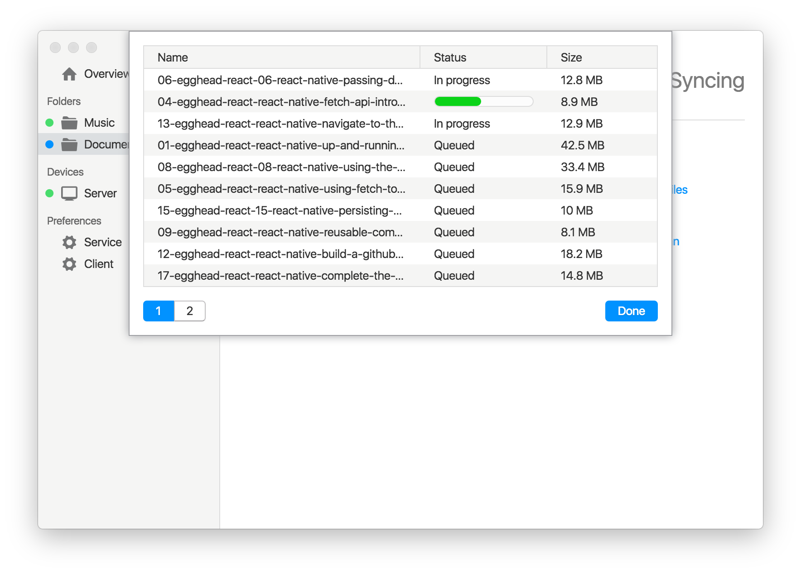
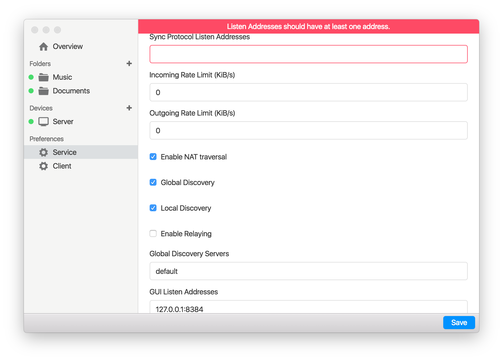

### Summary

Syncthing Desktop is an application for macOs (and probaly linux in the future) that gives you a user friendly and beautiful interface for [Syncthing](https://syncthing.net/) (not provided with application).

It is build with [Electron](http://electron.atom.io/) and web technologies like [React](https://facebook.github.io/react/), and [Redux](http://redux.js.org/) while trying to keep it native feeling and performant.

If you want to request a feature just open a new issue describing it.

If you like the project please consider donating a small ammount so that this student can buy pasta instead of noodles.

- [Paypal](https://www.paypal.me/JodusNodus)
- Bitcoin: 18VVyVzwRE1ozhirLero93jxkC8T38zu2j

### Overview

When the app is opened for the first time it will search for local Syncthing instances if none are found you can always enter it manually.

Notifications keep you up to date even when the window is closed.

Adding a device is easy. Just paste or type the device ID or if you have the QR-Code of the device you can scan it straight from the webcam.

A tray icon and menu with basic information will remain open even when the window is closed (notifications will also still be pushed).

### Development
1. Clone the repo
2. Install depencies `npm i`
3. Start main process compiler `npm run build-main:watch`
4. Start hot reloading server for renderer process `npm run hot-server`
5. Start the application `npm start`

The Syncthing API wrapper is seperated at [node-syncthing](https://github.com/JodusNodus/node-syncthing).